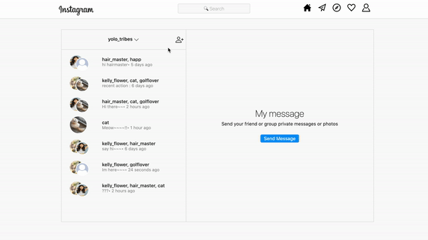

# instagram clone (web)

This repository is for cloning an instagram web application.
If you want to see the demo version, [click here](https://ahrastargram.netlify.app/)

[](https://app.netlify.com/sites/ahrastargram/deploys)

## Main Functions

1. It can see your friends' photos with an **awesome slider**.

2. You can **comment your idea** and show **your like** on your friend's posting.

3. It can provide **search** tools to find users and posting.


4. You can **follow/unfollow** interesting users.


## Message

You can send your friends direct messages on real-time. It auto-scrolls when you enter a message room to make it easier to check the latest message.



## Usage

```
$ cd ../insta-clone_frontend
$ npm i
$ npm start
```

After you clone this repo to your desktop, go to its root directory and run `npm install` to install its dependencies.

Once the dependencies are installed, you can run `npm start` to start the application.

## Feedback

### Development

Want to contribute? Great!

To fix a bug or enhance an existing module, follow these steps:

- Fork the repo
- Create a new branch (`git checkout -b improve-feature`)
- Make the appropriate changes in the files
- Add changes to reflect the changes made
- Commit your changes (`git commit -am 'Improve feature'`)
- Push to the branch (`git push origin improve-feature`)
- Create a Pull Request

### Bug / Feature Request

If you find a bug (the API couldn't handle the query and / or gave undesired results), kindly open an issue [here](https://github.com/iknowahra/insta-clone_frontend/issues/new) by including your search query and the expected result.

If you'd like to request a new function, feel free to do so by opening an issue [here](https://github.com/iknowahra/insta-clone_frontend/issues/new). Please include sample queries and their corresponding results.
